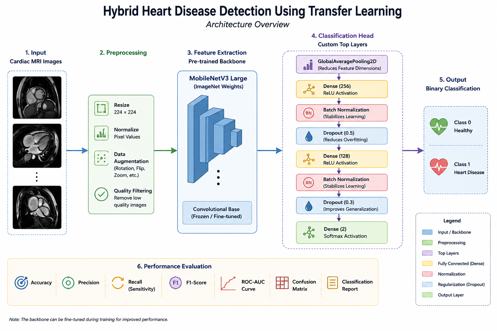
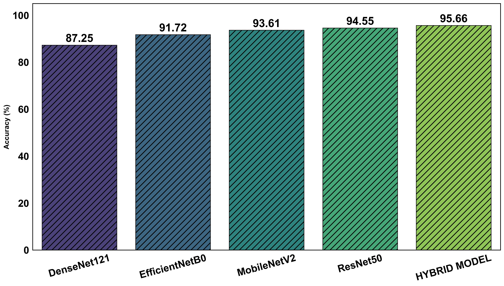
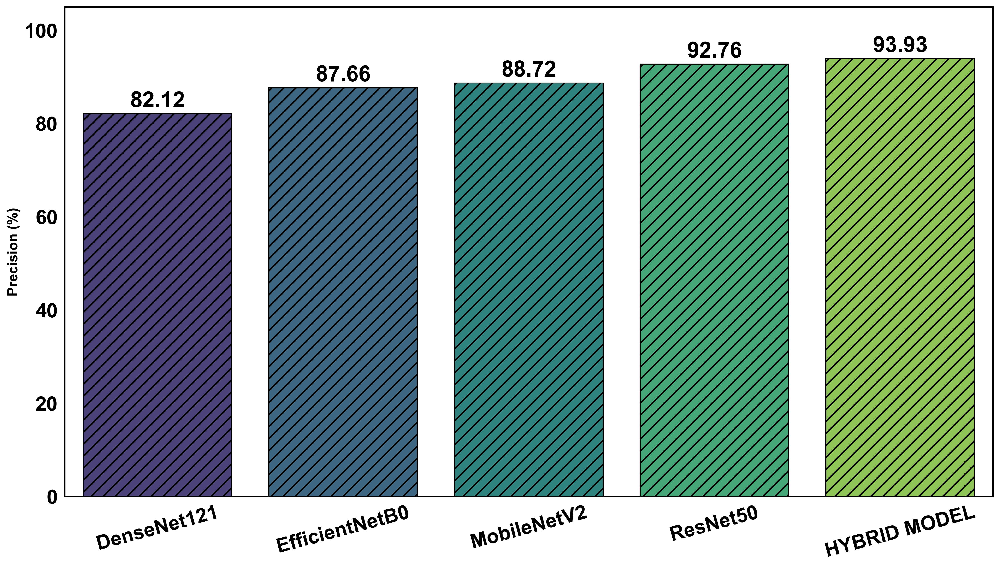
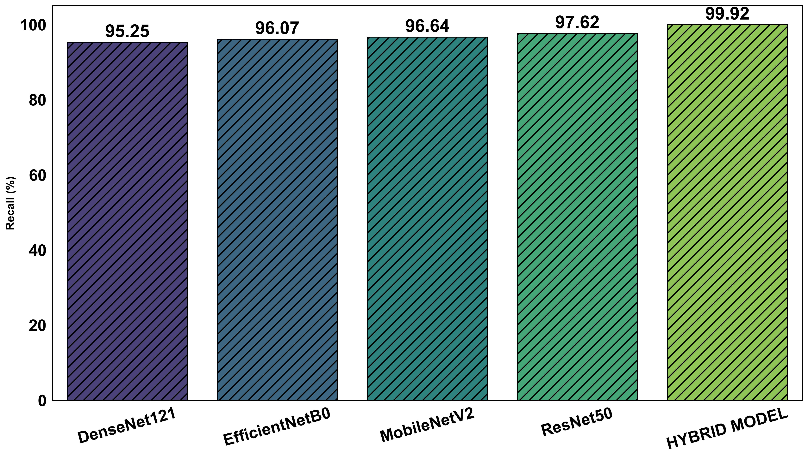
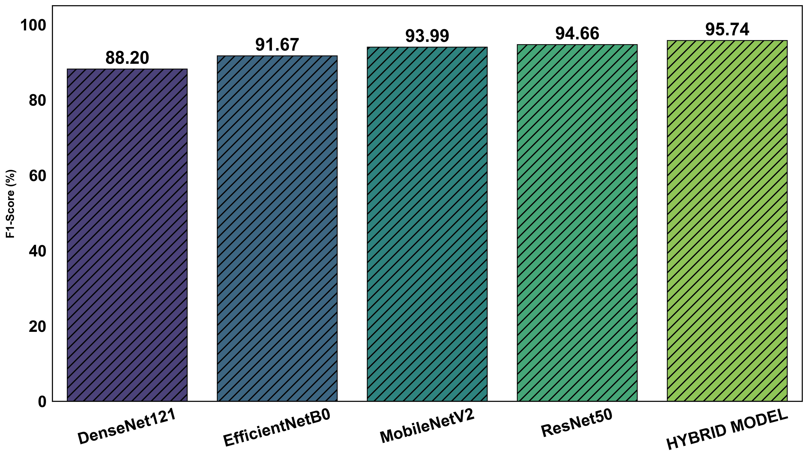
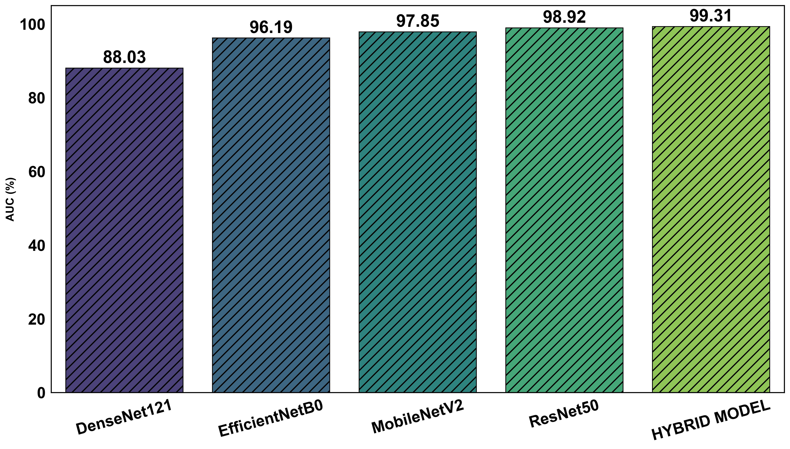

#  Hybrid Heart Disease Detection Using Transfer Learning

<p align="center">


</p>


##  Architecture

<p align="center">

</p>


##  Overview

This project presents a **hybrid transfer learning framework** for binary heart disease classification using **cardiac MRI images**. Multiple CNN architectures were evaluated, and a **MobileNetV3-based hybrid model** achieved the best overall performance.


##  Features

-  Binary Heart Disease Classification
-  Transfer Learning using MobileNetV3 Large
-  Performance Comparison with Multiple CNN Models
-  ROC-AUC and Confusion Matrix Analysis
-  Research-oriented Implementation

## Dataset

- Total Images: 12,200
- Classes: Normal / Sick
- Image Size: 224 × 224
- Train/Test Split: 80/20
- Data Augmentation: Rotation, Zoom, Translation, Horizontal Flip

#  Results

## Best Performance

<p align="center">

| Accuracy | Precision | Recall | F1-Score | ROC-AUC |
|:--------:|:---------:|:------:|:--------:|:-------:|
| **95.66%** | **93.93%** | **99.92%** | **95.74%** | **99.31%** |

</p>


##  Performance Comparison

<p align="center">




</p>

<p align="center">




</p>

<p align="center">



</p>

##  Models Evaluated

| Model | Status |
|--------|--------|
| MobileNetV3 Large | ✅ Final Model |
| ResNet50 | Baseline |
| EfficientNetB0 | Baseline |
| DenseNet121 | Baseline |


##  Repository Structure

```text
Hybrid-Heart-Disease-Detection
│
├── Images/
├── Results/
├── Notebooks/
├── docs/
├── README.md
└── requirements.txt
```


##  Installation

```bash
git clone https://github.com/srikar06-ai/Hybrid-Heart-Disease-Detection.git

cd Hybrid-Heart-Disease-Detection

pip install -r requirements.txt
```


##  Research

Presented at:

**8th International Conference on Engineering & Advancement in Technology (ICEAT 2026)**


## Future Work

- Extend the framework to multi-class cardiac disease classification.
- Incorporate clinical metadata for multimodal learning.
- Optimize the model for edge-device deployment.
- Validate the framework on larger multi-center datasets.

## Author

**P. Srikar Kashyap**

- GitHub: https://github.com/srikar06-ai
- LinkedIn: https://linkedin.com/in/srikar-kashyap-020576317

## Citation

```bibtex
@inproceedings{srikar2026heart,
  title={Heart Disease Detection and Classification Using Hybrid Transfer Learning},
  author={P. Srikar Kashyap and others},
  booktitle={ICEAT},
  year={2026}
}
```